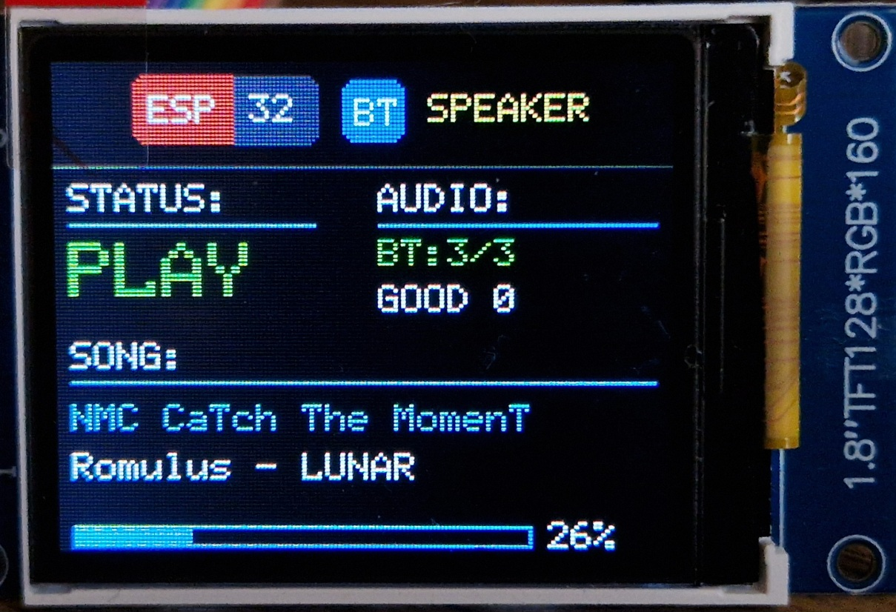

# ESP32 Bluetooth Speaker – funkciók és alkatrészleírás - HU/EN

Egy egyszerű, önálló **Bluetooth A2DP hangszóró / Bluetooth audio receiver** projekt klasszikus ESP32 modulra.  
A telefon vagy laptop Bluetooth hangkimenetként csatlakozik az ESP32-höz, az ESP32 pedig I2S-en továbbítja a hangot egy külső DAC vagy I2S erősítő modul felé.

<p align="center">
  
</p>

A projekt célja egy kis, kijelzős BT hangszóró építése maradék ESP32 hardverből, 1.8" ST7735 TFT kijelzővel és I2S hangmodullal.

---

## Fő funkciók

- **Bluetooth A2DP Sink mód**
  - A telefon/laptop Bluetooth hangszóróként látja az ESP32-t.
  - A médiahang Bluetooth-on érkezik az ESP32-re.
  - A hang I2S kimeneten megy tovább DAC vagy erősítő modul felé.

- **AVRCP metaadat kijelzés**
  - Előadó neve.
  - Szám címe.
  - Lejátszási állapot: `PAIR`, `READY`, `PLAY`, `PAUSE`, `STOP`.

- **Bluetooth jelerősség kijelzés**
  - Classic Bluetooth RSSI delta alapján.
  - Nem WiFi-szerű pontos dBm mérés, hanem relatív kapcsolatminőség.
  - Kijelzés:
    - `BT:3/3` – jó kapcsolat
    - `BT:2/3` – közepes kapcsolat
    - `BT:1/3` – gyenge kapcsolat
    - `BT:0/3` – rossz kapcsolat
  - Szöveges minősítés:
    - `GOOD`
    - `FAIR`
    - `WEAK`
    - `BAD`
  - A jelerősség frissítése részleges képernyőfrissítéssel történik, így nem villogtatja újra a teljes kijelzőt.

- **1.8" TFT kijelző UI**
  - ST7735 128×160 kijelző landscape módban.
  - Kódból rajzolt felület, bitmap háttér nélkül.
  - Fejléc:
    - ESP32 jellegű badge
    - BT ikon
    - `SPEAKER` felirat
  - Külön blokkok:
    - `STATUS`
    - `AUDIO`
    - `SONG`
    - hangerősáv

- **Hangerő kijelzés**
  - AVRCP hangerő callback alapján.
  - A telefon médiahangerejét százalékosan jeleníti meg.
  - Alsó hangerősáv mutatja az aktuális szintet.

---

## Használt hardver

### 1. ESP32

A projekt klasszikus ESP32 modulra készült, például:

- ESP32 DevKit
- ESP32-WROOM-32
- ESP32-WROOM-32U

Fontos: a projekt **Classic Bluetooth A2DP** funkciót használ, ezért olyan ESP32 kell, amely támogatja a klasszikus Bluetooth-t.  
Az ESP32-C3 / C6 típusok nem megfelelőek ehhez, mert azok nem klasszikus Bluetooth A2DP eszközök.

Az ESP32-U / ESP32-WROOM-32U külső antennacsatlakozója a WiFi mellett Bluetoothhoz is használható, mert a WiFi és a Classic BT ugyanazt a 2.4 GHz-es rádiós részt és antennakimenetet használja.

---

### 2. Hangmodul

Tesztelt / célzott hangmodulok:

- WeAct I2S Speaker Module PCM5100A 2×3 W
- PCM5102A / DAC5102 I2S DAC modul

A WeAct PCM5100A 2×3 W modul előnye, hogy nem csak DAC, hanem erősítős hangszórómodul is, ezért közvetlenebbül használható kis hangszóróhoz.

A sima PCM5102A / DAC5102 modul inkább line-out jellegű, ezért ahhoz külön erősítő szükséges.

---

### 3. Kijelző

A végül használt kijelző:

- 1.8" TFT
- 128×160 felbontás
- ST7735 / ST7735S vezérlő
- 8 pines SPI modul

A kijelző landscape módban 160×128-as felületként működik.

---

## Bekötés

### ST7735 TFT kijelző

| ST7735 pin | ESP32 pin |
|---|---|
| GND | GND |
| VCC | 3V3 |
| SCL / SCK | GPIO18 |
| SDA / MOSI | GPIO23 |
| RES / RST | GPIO4 |
| DC | GPIO16 |
| CS | GPIO17 |
| BLK / LED | GPIO21 |

Megjegyzés: a kijelzőn az `SDA` felirat SPI MOSI jelet jelent.

---

### I2S audio modul

| I2S modul pin | ESP32 pin |
|---|---|
| BCLK / BCK | GPIO26 |
| LRC / LRCK / WS | GPIO25 |
| DIN / DATA | GPIO22 |
| VCC | 5V az erősítős modulnál |
| GND | GND |

Fontos:
- a `DIN` / `DATA` bemenetet kell használni, nem `DOUT`;
- ha a modulon van `MCLK` vagy `SCK`, az PCM5102/PCM5100A modulnál általában üresen hagyható;
- az erősítős modulhoz stabil 5 V táp ajánlott;
- minden modul GND-je legyen közösítve.

---

## Arduino környezet

Ajánlott beállítások:

| Beállítás | Érték |
|---|---|
| Arduino IDE | 1.8.19 |
| ESP32 board package | esp32 by Espressif Systems 2.0.17 |
| Board | ESP32 Dev Module |
| CPU Frequency | 240 MHz |
| Flash Frequency | 40 MHz vagy 80 MHz |
| Flash Mode | DIO vagy QIO, paneltől függően |
| Flash Size | 4 MB |
| Partition Scheme | Minimal SPIFFS vagy Default 4MB with SPIFFS |
| PSRAM | Disabled |
| Upload Speed | ha instabil, 115200 |

Ha feltöltésnél a kapcsolat megszakad nagy baudon, érdemes az Upload Speed értékét 115200-ra venni.

---

## Szükséges könyvtárak

Arduino Library Managerből:

- `ESP32-A2DP` by Phil Schatzmann
- `Adafruit GFX Library`
- `Adafruit ST7735 and ST7789 Library`
- `Adafruit BusIO`

A használt ESP32-A2DP verzióval előfordulhat, hogy az `ESP_A2D_AUDIO_STATE_SUSPEND` enum hiányzik az ESP32 core 2.0.17 alatt. Ebben az esetben a könyvtárban minden ilyen előfordulás cserélhető erre:

```cpp
ESP_A2D_AUDIO_STATE_STOPPED
```

---

## Bluetooth működés

Az ESP32 Bluetooth eszköznév:

```cpp
ESP32 BT Speaker
```

A telefon Bluetooth menüjében ez az eszköz jelenik meg.  
Csatlakozás után a telefon médiahang kimeneteként használható.

Ha a telefon látja, de nem csatlakozik:
1. a telefonon el kell felejteni az eszközt;
2. a telefon Bluetooth-t ki/be kell kapcsolni;
3. az ESP32-t újra kell indítani;
4. szükség esetén teljes flash erase után újra feltölteni a firmware-t.

---

## Kijelzőn megjelenő információk

### Fejléc

```text
[ESP32 badge] [BT ikon] SPEAKER
```

A fejléc vízszintesen középre van számolva a 160 pixel széles kijelzőn:

```text
ESP badge: 48 px
köz:       6 px
BT ikon:   16 px
köz:       6 px
SPEAKER:   42 px
összesen: 118 px
kezdő X:  (160 - 118) / 2 = 21 px
```

### STATUS blokk

A Bluetooth/lejátszási állapotot mutatja:

- `PAIR`
- `READY`
- `PLAY`
- `PAUSE`
- `STOP`

### AUDIO blokk

A Bluetooth kapcsolat minőségét mutatja:

```text
BT:3/3
GOOD 0
```

vagy gyenge kapcsolatnál például:

```text
BT:0/3
BAD -50
```

A szám a Classic BT RSSI delta értéke, nem pontos dBm.

### SONG blokk

Kapcsolat nélkül vagy metaadat nélkül:

```text
Artist: -
Title : -
```

Lejátszás közben a több hely miatt csak az előadó és számcím jelenik meg prefix nélkül.

---

## Fontos tapasztalatok

- A telefon médiahangereje külön számít. Ha minden csatlakozik, de nincs hang, elsőként a telefon Bluetooth médiahangerejét kell ellenőrizni.
- Ha az antenna le van véve vagy a telefont leárnyékoljuk, a hang szakadozhat, és az RSSI kijelzés `BAD` / `BT:0/3` értékre eshet.
- Az ESP32-U külső antennája Bluetoothra is hatással van.

---

## Fájlszerkezet

Ajánlott:

```text
ESP32_BT_Speaker/
  ESP32_BT_Speaker.ino
```

---

## Rövid projektösszefoglaló

Ez a projekt egy klasszikus ESP32 alapú Bluetooth hangszóró, amely:

- Bluetooth A2DP-n fogadja a hangot;
- I2S-en küldi tovább DAC/erősítő modulnak;
- ST7735 TFT kijelzőn megjeleníti az állapotot;
- mutatja a lejátszott szám előadóját és címét;
- relatív Bluetooth jelerősséget is kijelez;
- kis méretű, egyszerűen építhető, maradék hardverekből is jól használható eszköz.

---

# English version

# ESP32 Bluetooth Speaker – Features and Hardware Description

A simple standalone **Bluetooth A2DP speaker / Bluetooth audio receiver** project for classic ESP32 modules.  
A phone or laptop connects to the ESP32 as a Bluetooth audio output device, and the ESP32 forwards the audio through I2S to an external DAC or I2S amplifier module.

The goal of the project is to build a small display-equipped Bluetooth speaker from spare ESP32 hardware, using a 1.8" ST7735 TFT display and an I2S audio module.

---

## Main Features

- **Bluetooth A2DP Sink mode**
  - A phone or laptop sees the ESP32 as a Bluetooth speaker.
  - Media audio is received by the ESP32 over Bluetooth.
  - The audio is sent out through I2S to a DAC or amplifier module.

- **AVRCP metadata display**
  - Artist name.
  - Track title.
  - Playback state: `PAIR`, `READY`, `PLAY`, `PAUSE`, `STOP`.

- **Bluetooth signal strength display**
  - Based on Classic Bluetooth RSSI delta.
  - This is not a precise WiFi-style dBm measurement, but a relative link-quality value.
  - Display:
    - `BT:3/3` – good connection
    - `BT:2/3` – medium connection
    - `BT:1/3` – weak connection
    - `BT:0/3` – poor connection
  - Text quality indicator:
    - `GOOD`
    - `FAIR`
    - `WEAK`
    - `BAD`
  - Signal strength updates use partial screen redraws, so the whole display does not flicker on every refresh.

- **1.8" TFT display UI**
  - ST7735 128×160 display used in landscape mode.
  - Code-drawn interface, without a bitmap background.
  - Header:
    - ESP32-style badge
    - BT icon
    - `SPEAKER` label
  - Separate blocks:
    - `STATUS`
    - `AUDIO`
    - `SONG`
    - volume bar

- **Volume display**
  - Based on AVRCP volume callback.
  - Shows the phone’s media volume as a percentage.
  - The bottom volume bar displays the current level.

---

## Hardware Used

### 1. ESP32

The project was made for classic ESP32 modules, for example:

- ESP32 DevKit
- ESP32-WROOM-32
- ESP32-WROOM-32U

Important: the project uses **Classic Bluetooth A2DP**, so it requires an ESP32 that supports classic Bluetooth.  
ESP32-C3 / C6 boards are not suitable for this project, because they are not Classic Bluetooth A2DP devices.

The external antenna connector on ESP32-U / ESP32-WROOM-32U modules is usable for Bluetooth as well as WiFi, because WiFi and Classic BT share the same 2.4 GHz radio path and antenna output.

---

### 2. Audio module

Tested / target audio modules:

- WeAct I2S Speaker Module PCM5100A 2×3 W
- PCM5102A / DAC5102 I2S DAC module

The advantage of the WeAct PCM5100A 2×3 W module is that it is not only a DAC, but also an amplified speaker module, so it can be used more directly with small speakers.

A plain PCM5102A / DAC5102 module is more like a line-out DAC, so it requires a separate amplifier.

---

### 3. Display

The display used in the final version:

- 1.8" TFT
- 128×160 resolution
- ST7735 / ST7735S controller
- 8-pin SPI module

In landscape mode, the display is used as a 160×128 screen.

---

## Wiring

### ST7735 TFT display

| ST7735 pin | ESP32 pin |
|---|---|
| GND | GND |
| VCC | 3V3 |
| SCL / SCK | GPIO18 |
| SDA / MOSI | GPIO23 |
| RES / RST | GPIO4 |
| DC | GPIO16 |
| CS | GPIO17 |
| BLK / LED | GPIO21 |

Note: on this display module, the `SDA` label means SPI MOSI.

---

### I2S audio module

| I2S module pin | ESP32 pin |
|---|---|
| BCLK / BCK | GPIO26 |
| LRC / LRCK / WS | GPIO25 |
| DIN / DATA | GPIO22 |
| VCC | 5V for the amplified module |
| GND | GND |

Important:
- use the `DIN` / `DATA` input, not `DOUT`;
- if the module has `MCLK` or `SCK`, it can usually be left unconnected with PCM5102/PCM5100A modules;
- a stable 5 V supply is recommended for the amplified module;
- all module grounds must be connected together.

---

## Arduino Environment

Recommended settings:

| Setting | Value |
|---|---|
| Arduino IDE | 1.8.19 |
| ESP32 board package | esp32 by Espressif Systems 2.0.17 |
| Board | ESP32 Dev Module |
| CPU Frequency | 240 MHz |
| Flash Frequency | 40 MHz or 80 MHz |
| Flash Mode | DIO or QIO, depending on the board |
| Flash Size | 4 MB |
| Partition Scheme | Minimal SPIFFS or Default 4MB with SPIFFS |
| PSRAM | Disabled |
| Upload Speed | 115200 if upload is unstable |

If upload fails at a high baud rate, reduce the Upload Speed to 115200.

---

## Required Libraries

Install from the Arduino Library Manager:

- `ESP32-A2DP` by Phil Schatzmann
- `Adafruit GFX Library`
- `Adafruit ST7735 and ST7789 Library`
- `Adafruit BusIO`

With the ESP32-A2DP version used during this build, the `ESP_A2D_AUDIO_STATE_SUSPEND` enum may be missing under ESP32 core 2.0.17. In that case, every occurrence in the library can be replaced with:

```cpp
ESP_A2D_AUDIO_STATE_STOPPED
```

---

## Bluetooth Operation

The ESP32 Bluetooth device name is:

```cpp
ESP32 BT Speaker
```

This device appears in the phone’s Bluetooth menu.  
After connecting, it can be used as a media audio output device.

If the phone can see the device but cannot connect:
1. forget/remove the device on the phone;
2. turn Bluetooth off and back on on the phone;
3. restart the ESP32;
4. if needed, erase the full flash and upload the firmware again.

---

## Displayed Information

### Header

```text
[ESP32 badge] [BT icon] SPEAKER
```

The header is horizontally centered on the 160-pixel-wide display:

```text
ESP badge: 48 px
gap:        6 px
BT icon:    16 px
gap:        6 px
SPEAKER:    42 px
total:      118 px
start X:    (160 - 118) / 2 = 21 px
```

### STATUS block

Shows the Bluetooth / playback state:

- `PAIR`
- `READY`
- `PLAY`
- `PAUSE`
- `STOP`

### AUDIO block

Shows Bluetooth link quality:

```text
BT:3/3
GOOD 0
```

or, with a weak connection, for example:

```text
BT:0/3
BAD -50
```

The number is the Classic BT RSSI delta value, not an exact dBm reading.

### SONG block

Without connection or metadata:

```text
Artist: -
Title : -
```

During playback, the artist and track title are shown without prefixes to leave more room for text.

---

## Important Notes and Lessons Learned

- The phone’s media volume is separate. If everything connects but there is no sound, first check the phone’s Bluetooth media volume.
- If the antenna is removed or the phone is shielded, audio may stutter and the RSSI display can fall to `BAD` / `BT:0/3`.
- The external antenna on ESP32-U affects Bluetooth as well.

---

## File Structure

Recommended:

```text
ESP32_BT_Speaker/
  ESP32_BT_Speaker.ino
```

---

## Short Project Summary

This project is a classic ESP32-based Bluetooth speaker that:

- receives audio over Bluetooth A2DP;
- sends audio to a DAC/amplifier module over I2S;
- displays status information on an ST7735 TFT display;
- shows the currently playing artist and track title;
- displays relative Bluetooth signal quality;
- is compact, simple to build, and works well as a useful project for spare ESP32 hardware.
